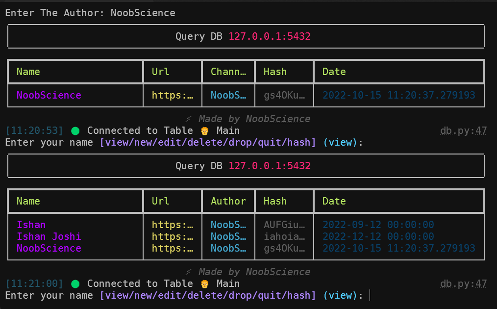

# dbview

This is a very simple implementation of postgres database in python.

## Requirements:

1. [Postgres](https://www.postgresql.org/)

2. [Python 3.6<](https://python.org)

3. [rich · PyPI](https://pypi.org/project/rich/)

4. [psycopg2 · PyPI](https://pypi.org/project/psycopg2/)

## Installation:

To Install dbview on your local machine, you can clone the repo and download the requirements

```bash
git clone https://github.com/newtoallofthis123/dbview.git
cd dbview
pip3 install -r requirements.txt
```

Now, open up stuff.json and enter your password, username and port.

Now to lauch dbview, just go

```bash
python3 db.py
```

## Customize

It uses the [rich](https://pypi.org/project/rich/) library in python to render the results in a beautiful UI.

The python library psycopg2 is used to interact with the postgres database

You can use db view to store a variety of things. All you need to do is change the source code to suit your needs.

By default, the table structure is

```python
cursor.execute("""
    CREATE TABLE IF NOT EXISTS main(
    name TEXT NOT NULL,
    url TEXT NOT NULL,
    author TEXT,
    hash TEXT NOT NULL,
    date TIMESTAMP;
""")
```

You can customize this anytime to your need.

To use dbview, you must have postgres installed on your system.

You can get postgres from [here](https://www.postgresql.org/)

## Stuff Used

1. Python

2. Rich

3. Postgres

## End Result



So, hope you like it. If you do, please be sure to leave a star and fork my repo to get your own dbview.

> NoobScience 2022
